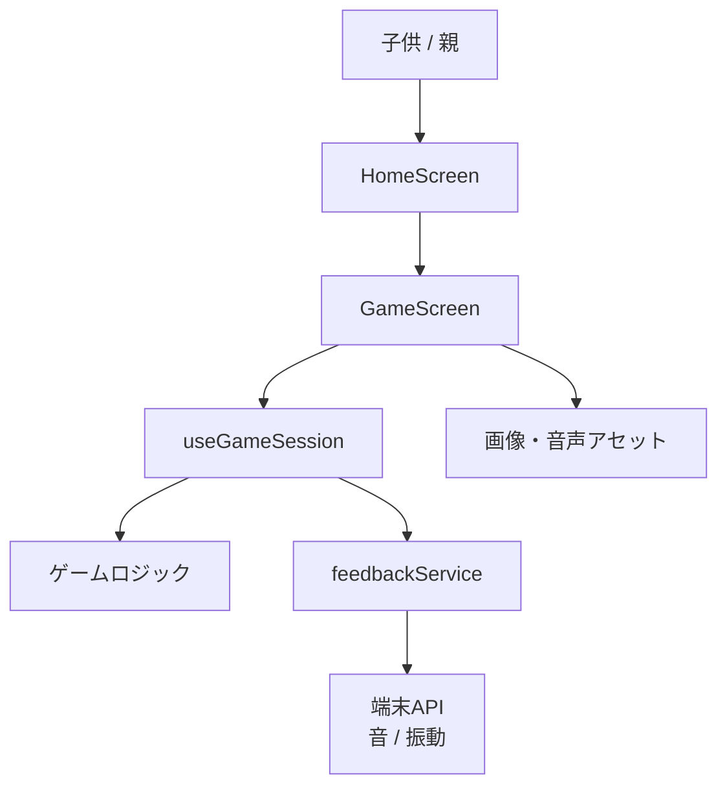
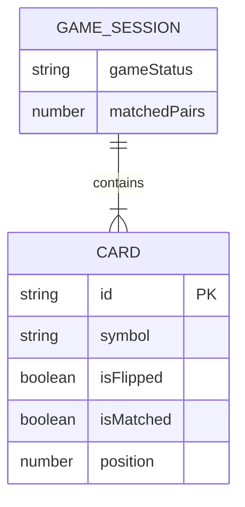
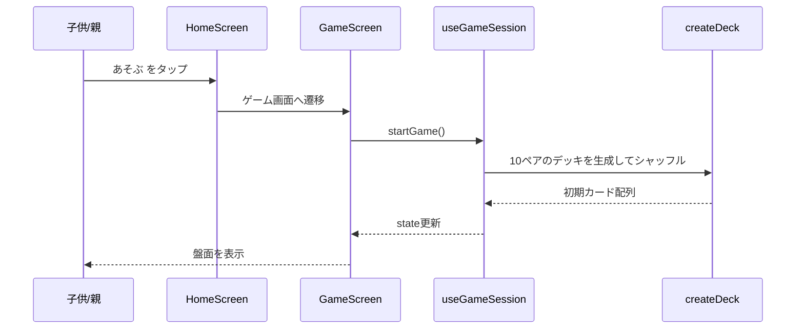
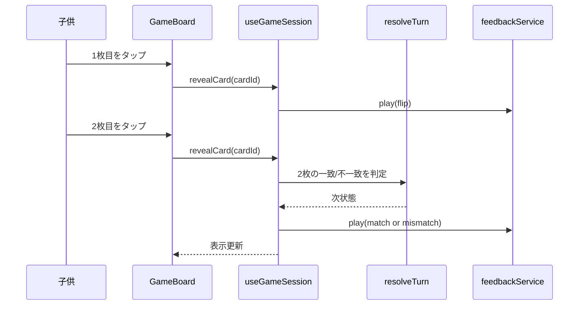
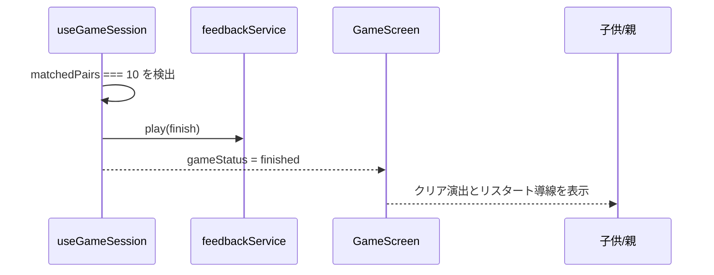
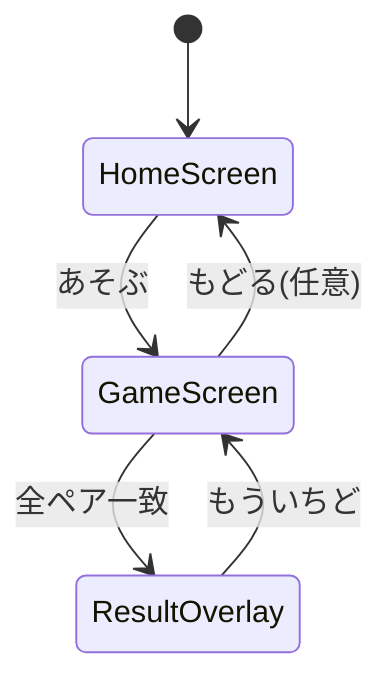

# 機能設計書 (Functional Design Document)

## 対象範囲

本書は `docs/product-requirements.md` のMVP要件を、モバイルアプリの具体的な画面・状態・ロジックに落とし込む。  
対象は、オフラインで遊べる子供向け神経衰弱アプリの初期リリース機能とする。

## システム構成図



## 技術スタック

| 分類 | 技術 | 選定理由 |
|------|------|----------|
| 言語 | JavaScript (ES2022) | React Native + Expo の標準的な実装パスに沿いやすく、JSDocとテストで状態の期待値を補える |
| フレームワーク | React Native + Expo | モバイル向けUIと端末機能の利用を短期間で実現しやすい |
| 状態管理 | React state / reducer + custom hooks | MVPでは外部状態管理ライブラリなしで十分にシンプルに保てる |
| アニメーション | React Native Animated API | 依存を増やしすぎずにカード反転やクリア演出を実装できる |
| 端末フィードバック | Expo管理のデバイス機能モジュール | 振動や音の再生をExpoワークフロー内で扱いやすい |
| ユニットテスト | Vitest | 既存リポジトリで導入済みであり、純粋関数中心のゲームロジックを検証しやすい |
| コンポーネントテスト | `@testing-library/react-native` | HomeScreen / GameScreen / GameBoard の描画と操作フローを検証できる |

## データモデル定義

### エンティティ: CardModel

```javascript
/**
 * @typedef {'apple' | 'balloon' | 'cat' | 'cloud' | 'flower'
 * | 'moon' | 'rainbow' | 'star' | 'sun' | 'unicorn'} CardSymbol
 */

/**
 * @typedef {Object} CardModel
 * @property {string} id 盤面内で一意のID
 * @property {CardSymbol} symbol ペア判定に使う絵柄
 * @property {boolean} isFlipped 一時的に表向きか
 * @property {boolean} isMatched マッチ済みか
 * @property {number} position 配置順
 */
```

**制約**:
- `symbol` は10種類を各2枚ずつ持つ
- `isMatched = true` のカードは以後裏返らない
- `position` は 0..19 の連番とする

### エンティティ: GameSessionState

```javascript
/**
 * @typedef {'idle' | 'playing' | 'resolving' | 'finished'} GameStatus
 */

/**
 * @typedef {Object} GameSessionState
 * @property {CardModel[]} cards
 * @property {string[]} selectedCardIds 長さ0..2
 * @property {number} matchedPairs 0..10
 * @property {GameStatus} gameStatus
 */
```

**制約**:
- `selectedCardIds` は最大2件
- `matchedPairs` は `cards` 上の `isMatched` と矛盾してはならない
- `gameStatus = 'resolving'` の間は追加タップを無視する
- `matchedPairs = 10` になった時点で `gameStatus = 'finished'` へ遷移する

### エンティティ: GameConfig

```javascript
/**
 * @typedef {Object} GameConfig
 * @property {number} rows 盤面の行数
 * @property {number} columns 盤面の列数
 * @property {number} pairCount 使用するペア数
 * @property {number} mismatchDelayMs ミスマッチ時に戻すまでの待機時間
 */
```

**制約**:
- `rows * columns = pairCount * 2`
- MVPの初期値は `rows = 5`、`columns = 4`、`pairCount = 10`
- `mismatchDelayMs` は 800..1200ms の範囲に収める

### ER図



## コンポーネント設計

### HomeScreen

**責務**:
- アプリの第一画面を表示する
- 「あそぶ」などの主要アクションを分かりやすく提示する

**インターフェース**:
```javascript
/**
 * @typedef {Object} HomeScreenProps
 * @property {function(): void} onStart
 */
```

**依存関係**:
- `shared/components`
- `shared/theme`

### GameScreen

**責務**:
- ゲーム盤面、進行状態、リスタート操作を表示する
- `useGameSession` から受け取った状態をUIに反映する

**インターフェース**:
```javascript
/**
 * @typedef {Object} GameScreenProps
 * @property {function(): void} [onExitToHome]
 */
```

**依存関係**:
- `features/memory-game/components`
- `features/memory-game/hooks/useGameSession`
- `shared/components`

### GameBoard / MemoryCard

**責務**:
- 4 x 5盤面を表示する
- 各カードの見た目とタップ可能状態を管理する

**インターフェース**:
```javascript
/**
 * @typedef {Object} GameBoardProps
 * @property {CardModel[]} cards
 * @property {boolean} disabled
 * @property {function(string): void} onCardPress
 */
```

**依存関係**:
- `features/memory-game/types`
- `shared/theme`

### useGameSession

**責務**:
- ゲーム状態を初期化、更新、リセットする
- ゲームロジック関数とフィードバックサービスをつなぐ

**インターフェース**:
```javascript
/**
 * @typedef {Object} UseGameSessionResult
 * @property {GameSessionState} state
 * @property {function(): void} startGame
 * @property {function(): void} restartGame
 * @property {function(string): void} revealCard
 */
```

**依存関係**:
- `features/memory-game/logic`
- `features/memory-game/services/feedbackService`

### feedbackService

**責務**:
- flip / match / mismatch / finish の演出トリガーを抽象化する
- 端末側APIが利用できない場合もゲーム進行を止めない

**インターフェース**:
```javascript
/**
 * @typedef {'flip' | 'match' | 'mismatch' | 'finish'} FeedbackKind
 */

/**
 * @typedef {Object} FeedbackService
 * @property {function(FeedbackKind): Promise<void>} play
 */
```

**依存関係**:
- Expo管理の音・振動モジュール
- アプリ内バンドルアセット

## ユースケース図

### ユースケース1: 新しいゲームを始める



**フロー説明**:
1. ユーザーがホーム画面の開始ボタンを押す
2. ゲーム画面が表示され、セッション初期化が走る
3. デッキ生成ロジックが20枚のカードを作りシャッフルする
4. 初期状態の盤面が描画される

### ユースケース2: 2枚めくって判定する



**フロー説明**:
1. 1枚目のカードを開く
2. 2枚目のカードを開いた時点でロジック判定を行う
3. 一致ならマッチ状態を維持し、不一致なら待機後に裏向きへ戻す
4. 結果に応じて視覚・音・振動のフィードバックを返す

### ユースケース3: ゲームクリア



## 画面遷移図



## アルゴリズム設計

### デッキ生成 (`createDeck`)

**目的**: 10種類の絵柄から20枚のカードを生成し、毎回異なる順序で配置する

**ロジック**:
1. 固定の `CardSymbol` 一覧を読み込む
2. 各絵柄を2枚ずつ複製して20件のカードを作る
3. Fisher-Yatesシャッフルで順序を乱す
4. `position` を再採番し、すべて `isFlipped = false`、`isMatched = false` にする

```javascript
function createDeck(symbols) {
  const pairedCards = symbols.flatMap((symbol, pairIndex) => [
    {
      id: `${symbol}-${pairIndex}-a`,
      symbol,
      isFlipped: false,
      isMatched: false,
      position: 0,
    },
    {
      id: `${symbol}-${pairIndex}-b`,
      symbol,
      isFlipped: false,
      isMatched: false,
      position: 0,
    },
  ]);

  const shuffled = shuffle(pairedCards);
  return shuffled.map((card, index) => ({ ...card, position: index }));
}
```

### ターン解決 (`resolveTurn`)

**目的**: 2枚の表向きカードが一致したかを判定し、次状態を返す

**計算ロジック**:
1. `selectedCardIds` から2枚のカードを取得する
2. `symbol` が一致するか比較する
3. 一致なら `isMatched = true` にし `matchedPairs + 1`
4. 不一致なら `resolving` 状態へ入り、遅延後に `isFlipped = false` に戻す
5. `matchedPairs === 10` で `finished` へ遷移する

## UI設計

### HomeScreen

**表示項目**:
| 項目 | 説明 | フォーマット |
|------|------|-------------|
| タイトル | アプリ名または分かりやすい遊びの説明 | 大きな見出し |
| 開始ボタン | 主要アクション | 画面内で最も大きいボタン |
| 補助説明 | 必要最小限の一文 | ひらがな中心の短文 |

### GameScreen

**表示項目**:
| 項目 | 説明 | フォーマット |
|------|------|-------------|
| 盤面 | 20枚カードを4 x 5で配置 | 縦画面に収まるグリッド |
| 進行表示 | 揃ったペア数や進行状況 | アイコン + 短文 |
| リスタート | いつでも遊び直せる操作 | 大きめのボタン |

### カラーと演出方針

- 成功: 明るい暖色またはポジティブなアクセント色を使う
- 失敗: 強い赤や警告音は避け、穏やかな戻りアニメーションにする
- 裏面と表面は十分なコントラスト差をつける
- 色だけでなくアニメーション、アイコン、位置で状態を伝える

## エラーハンドリング

### 想定する異常系

- 存在しない `cardId` が渡された場合: 状態を変えず安全に無視する
- 音声アセットの読み込み失敗: 音なしで継続する
- 振動APIが未対応: 視覚フィードバックのみで継続する
- 高速連打: `gameStatus = resolving` 中は入力を無視する

### UI上の扱い

- 子供向け体験を優先し、技術的エラーはポップアップで露出しない
- 開発時のみログで検知し、ユーザーにはプレイ可能な最小体験を維持する

## テスト設計

### ユニットテスト

- 実行基盤: `Vitest`
- 対象: `createDeck`、`resolveTurn`、`gameSelectors`
- 目的: ペア数、状態遷移、入力ガード、終了判定の正しさを固定する

### コンポーネントテスト

- 実行基盤: `Vitest` + `@testing-library/react-native`
- 対象: `HomeScreen`、`GameScreen`、`GameBoard`、`useGameSession` を含む主要表示フロー
- 補助: `src/shared/test-support/renderWithProviders.jsx` で共通ラッパーを提供する
- 目的: 開始導線、2枚目選択後の入力ロック、マッチ / ミスマッチ反映、クリア導線を検証する
- 制約: 音、振動、実端末依存の挙動は component test では保証しない

### 実機確認

- 対象: 音、振動、オフライン起動、起動時間、体感アニメーション
- 方法: iOS / Android 各1実機で確認する
- 記録先: `.steering/[YYYYMMDD]-[task]/tasklist.md`
