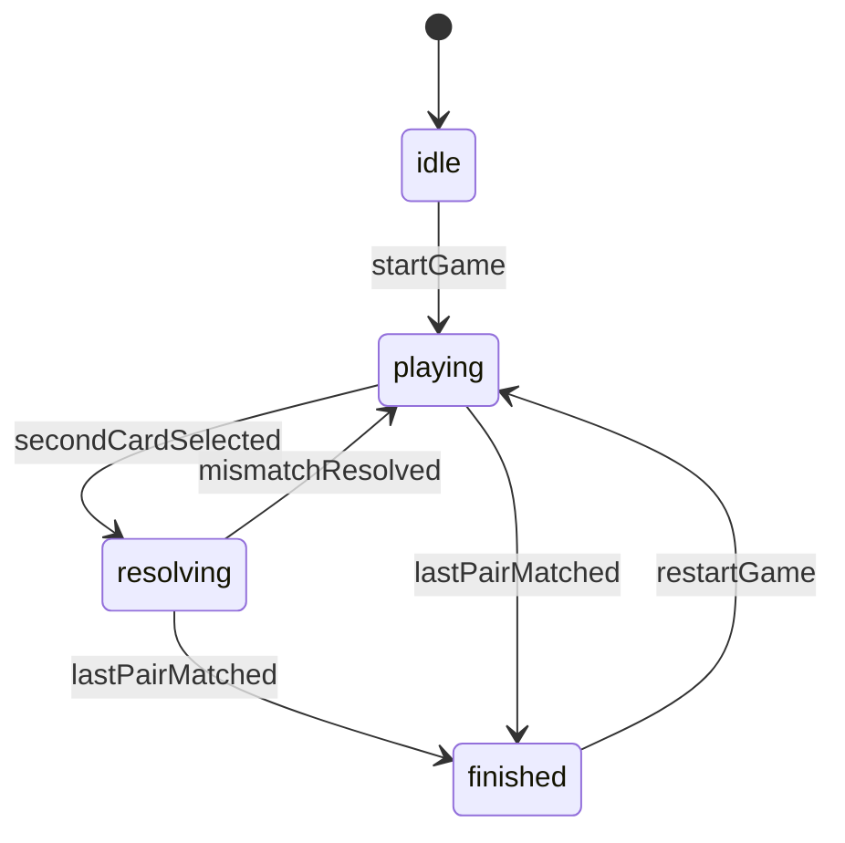

# プロジェクト用語集 (Glossary)

## 概要

このドキュメントは、Memory Game プロジェクトで使用するドメイン用語、技術用語、状態名を統一する。

**更新日**: 2026-03-13

## ドメイン用語

### Memory Game

**定義**: 本プロジェクトで開発する子供向けオフライン神経衰弱アプリ。

**説明**: 5歳前後の子供が短時間で遊べることを重視し、視覚・音・振動のフィードバックを備える。

**関連用語**: MVP、Game Session、Board

**使用例**:
- Memory Game のMVPは4 x 5盤面を採用する
- Memory Game はオフラインで完結する

**英語表記**: Memory Game

### Card

**定義**: 盤面上に配置される1枚のカード。

**説明**: 各カードは `symbol` を持ち、裏向き、表向き、マッチ済みの状態を取り得る。

**関連用語**: Pair、CardModel、Board

**使用例**:
- Card を1枚タップしてめくる
- マッチ済みの Card は表向きのまま残る

**英語表記**: Card

### Pair

**定義**: 同じ `symbol` を持つ2枚のカードの組。

**説明**: 1ゲームでは10ペアを用意し、すべて揃えるとクリアとなる。

**関連用語**: Card、Matched Pair

**使用例**:
- 1 Pair 見つけると `matchedPairs` が1増える

**英語表記**: Pair

### Matched Pair

**定義**: すでに一致判定が終わり、盤面上に固定された Pair。

**説明**: `isMatched = true` の2枚組を指す。`matchedPairs` はこの数を表す。

**関連用語**: Pair、Match

**使用例**:
- Matched Pair は裏向きに戻らない

**英語表記**: Matched Pair

### Board

**定義**: カードが並ぶゲーム盤面。

**説明**: MVPでは4列 x 5行、合計20枚のカードで構成する。

**関連用語**: Card、Game Session

**使用例**:
- Board は縦向き1画面内で完結する

**英語表記**: Board

### Game Session

**定義**: ゲーム開始からクリアまたはリスタートまでの1回のプレイ単位。

**説明**: `cards`、`selectedCardIds`、`matchedPairs`、`gameStatus` をまとめて管理する。

**関連用語**: GameSessionState、Restart

**使用例**:
- リスタートすると新しい Game Session が始まる

**英語表記**: Game Session

### Restart

**定義**: 現在のプレイを破棄し、新しい盤面でゲームをやり直す操作。

**説明**: MVPではホーム画面へ戻らなくてもリスタート可能とする。

**関連用語**: Game Session、HomeScreen

**使用例**:
- 子供が途中で難しいと感じたら Restart できる

**英語表記**: Restart

### Match / Mismatch

**定義**: 2枚のカードが一致した状態を Match、不一致の状態を Mismatch と呼ぶ。

**説明**: Match では成功フィードバックを返し、Mismatch では穏やかな戻り演出のみ行う。

**関連用語**: Pair、Feedback

**使用例**:
- Match 時はカードが固定される
- Mismatch 時は少し待ってから裏向きに戻る

**英語表記**: Match / Mismatch

### Feedback

**定義**: プレイヤーの操作や結果に応じて返す視覚、音、振動の反応全般。

**説明**: flip / match / mismatch / finish の各イベントに対して返す演出をまとめて指す。

**関連用語**: Match / Mismatch、Haptics

**使用例**:
- Match の Feedback では成功体験を強調する

**英語表記**: Feedback

## 技術用語

### React Native

**定義**: JavaScript でモバイルアプリを構築するためのフレームワーク。

**本プロジェクトでの用途**: iOS / Android向けの画面とインタラクションを実装する。

**バージョン**: Expoが対応する版を採用

**関連ドキュメント**: `docs/architecture.md`

### Expo

**定義**: React Nativeアプリの開発・実行・ビルドを支援するプラットフォーム。

**本プロジェクトでの用途**: モバイル実行基盤、端末機能利用、開発体験の簡素化。

**バージョン**: 導入時点の安定版を固定

**関連ドキュメント**: `docs/architecture.md`

### Haptics

**定義**: 端末の振動による触覚フィードバック。

**本プロジェクトでの用途**: Match や Finish 時に成功体験を強調する。

**バージョン**: Expo管理の対応モジュールに準拠

### Bundled Assets

**定義**: アプリに同梱される画像・音声などの静的ファイル。

**本プロジェクトでの用途**: オフライン環境でもカード画像と効果音を利用可能にする。

**関連ドキュメント**: `docs/repository-structure.md`

### Domain Logic

**定義**: UIや端末APIに依存しない、ゲームルールそのもののロジック。

**本プロジェクトでの用途**: デッキ生成、マッチ判定、ゲーム終了判定。

**関連ドキュメント**: `docs/functional-design.md`, `docs/architecture.md`

### JSDoc

**定義**: JavaScriptコードにコメントで構造や期待値を補足する記法。

**本プロジェクトでの用途**: JavaScript採用時に、カード構造や関数入出力の期待値を補助的に明示する。

**関連ドキュメント**: `docs/functional-design.md`, `docs/development-guidelines.md`

### `@testing-library/react-native`

**定義**: React Native UI をテスト環境で描画し、ユーザー操作を検証するための component test ライブラリ。

**本プロジェクトでの用途**: `HomeScreen` や `GameScreen` など、主要画面フローの component test を実行する。

**関連ドキュメント**: `docs/functional-design.md`, `docs/architecture.md`, `docs/development-guidelines.md`

## 略語・頭字語

### MVP

**正式名称**: Minimum Viable Product

**意味**: 最小限の価値検証ができる初期リリース範囲。

**本プロジェクトでの使用**: 4 x 5盤面、音・振動・アニメーション、リスタート機能を含む初期版。

### PRD

**正式名称**: Product Requirements Document

**意味**: プロダクト要求定義書。

**本プロジェクトでの使用**: `docs/product-requirements.md`

### UX

**正式名称**: User Experience

**意味**: ユーザー体験。

**本プロジェクトでの使用**: 子供が短時間で楽しく遊べる体験設計全般を指す。

### QA

**正式名称**: Quality Assurance

**意味**: 品質保証。

**本プロジェクトでの使用**: オフライン動作、クラッシュ、実機挙動の確認を指す。

## アーキテクチャ用語

### Feature-first Architecture

**定義**: 機能単位を中心にディレクトリを分ける設計方針。

**本プロジェクトでの適用**: `src/features/memory-game/` を中心にUI、hook、logic、serviceをまとめる。

**関連コンポーネント**: `GameScreen`, `useGameSession`, `feedbackService`

### Application Layer

**定義**: UI入力を受けて、ドメインロジックと端末サービスを調停する層。

**本プロジェクトでの適用**: `useGameSession` が中心となる。

**関連コンポーネント**: `useGameSession`

### Platform Layer

**定義**: 音、振動、将来のローカル保存など、端末依存処理を扱う層。

**本プロジェクトでの適用**: `feedbackService`、`audioService`、`hapticsService`

**関連コンポーネント**: `services/*`

### GameConfig

**定義**: 盤面サイズやミスマッチ待機時間など、ゲーム1回分の設定値をまとめた構造。

**本プロジェクトでの適用**: `rows`、`columns`、`pairCount`、`mismatchDelayMs` を持ち、難易度拡張の基点になる。

**関連コンポーネント**: `createDeck`, `resolveTurn`, `useGameSession`

## ステータス・状態

### `gameStatus`

| ステータス | 意味 | 遷移条件 | 次の状態 |
|----------|------|---------|---------|
| `idle` | ゲーム開始前 | ホーム画面表示、または初期化直後 | `playing` |
| `playing` | 通常プレイ中 | ゲーム開始後 | `resolving`, `finished` |
| `resolving` | 2枚の判定・戻し待ち中 | 2枚目をめくった直後 | `playing`, `finished` |
| `finished` | 全ペアを揃えた後 | `matchedPairs === 10` | `playing` (リスタート時) |

**状態遷移図**:

### Card State

| 状態 | 意味 | 判定方法 |
|------|------|---------|
| Hidden | 裏向きのカード | `isFlipped = false` かつ `isMatched = false` |
| Flipped | 一時的に表向きのカード | `isFlipped = true` かつ `isMatched = false` |
| Matched | 揃って固定されたカード | `isMatched = true` |

## データモデル用語

### CardModel

**定義**: カード1枚を表すアプリ内データ構造。

**主要フィールド**:
- `id`: 盤面内一意ID
- `symbol`: 絵柄
- `isFlipped`: 表向き状態
- `isMatched`: マッチ済み状態
- `position`: 配置順

**関連エンティティ**: GameSessionState

### GameSessionState

**定義**: 1プレイ分の状態をまとめた構造。

**主要フィールド**:
- `cards`: 全カード配列
- `selectedCardIds`: 現在めくられているカードID配列
- `matchedPairs`: 揃ったペア数
- `gameStatus`: プレイ状態

**関連エンティティ**: CardModel

### selectedCardIds

**定義**: 現在表向きになっている未確定カードのID一覧。

**制約**: 長さは0から2まで。

**使用例**:
- 2件になったら判定ロジックを起動する

## エラー・例外

### Feedback Unavailable

**定義**: 音または振動が端末側事情で利用できない状態。

**発生条件**: 権限、端末仕様、サイレント設定、API未対応など。

**対処方法**: 視覚フィードバックのみでゲームを継続する。

**例**:
- 振動非対応端末でもクリア演出は表示する
